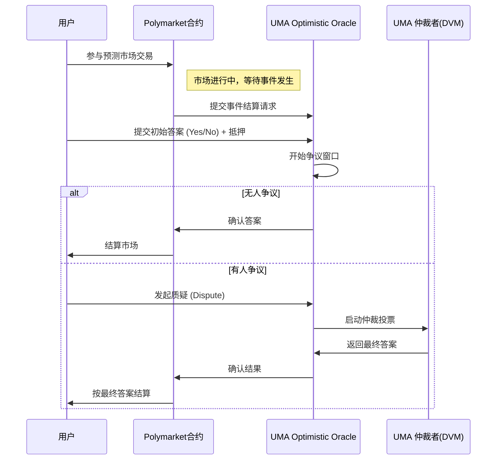

# 主流预言机对比：Chainlink / Pyth / UMA（以 Chainlink 的四项业务为主线）

> 现在我们来介绍一些当前有哪些主流的预言机平台，它们的特点是什么。

---

## 1. Chainlink 

Chainlink 是一个功能齐全的预言机生态，它有四项核心业务，分别是： **Data Feeds（价格喂价） / VRF（可验证随机数） / Automation（Keepers）/ Functions（Any API）** 接下来我做逐步说明。

---

### 1.1 Data Feeds（链上价格/数据喂价）

把多个链下数据源的价格/指标按设定聚合并安全发布到链上，供合约读取与决策（例如借贷清算、保证金计算等）。

**实现步骤**

1. 在合约代码中引用 Chainlink 的 Data Feed 合约地址（或在合约初始化时传入对应网络/资产的 price feed 地址）。
2. 在需要价格时调用 Chainlink 提供的 view 函数（例如 `latestRoundData()` / `getAnswer()` 等）获取当前价格或读取合约上存储的最新喂价。合约也可定期或事件触发去读价格以驱动业务逻辑（如清算）。
3. 多个 Chainlink 节点（Oracle 节点）周期性地从各自指定的链下来源（交易所、聚合器、API 提供商等）拉取原始价格观测值。节点使用 **Off-Chain Reporting (OCR)** 协议在链下互相交换/聚合观测值并达成共识，产生单一聚合报告（减少链上交易次数）。一轮聚合后，领导节点将聚合后的结果签名并把最终报告一次性提交到链上。
4. 链上 Data Feed 合约接收该聚合报告并更新其公示的最新价格／时间戳。任何合约随后读取即为多个节点共识的价格结果。

---

### 1.2 VRF（Verifiable Random Function，可验证随机数）

为链上合约生成可证明公平、不可预测且可核验的随机数，常用于抽奖、NFT 铸造排序、游戏等场景。

1. 合约向 Chainlink VRF 发起随机数请求（调用 VRF 协议的请求接口），通常要指定回调合约和请求参数并支付费用（或按订阅计费）。
2. 在请求发起后，合约进入等待状态；收到链上 VRF 的回调（包含随机数与证明）后，合约验证证明通过即使用随机数继续业务逻辑（比如分配 NFT 序号、决定中奖者）。
3. Chainlink 节点接收请求并在链下/节点间协作生成随机输出及对应的密码学证明（VRF 算法会以请求 seed 和节点私钥计算随机数与证明）。
4. 节点（或指定节点）把生成的随机数与证明提交到链上。链上合约（或 VRF 协议合约）验证该证明的有效性——只有在证明验证通过后，合约才接受该随机数作为真实且不可预测的随机源。

---

### 1.3 Automation / Keepers（自动化任务：代替 centralized cron）

按条件或定时触发链上合约函数，替代中心化的 off-chain cron jobs（例如触发定期清算、更新费率、管理头寸等）。Chainlink 的 Automation 服务也叫 Keepers / Automation。

1. 在合约中实现一个公开的 `check`（只读）函数（例如 `checkUpkeep`），该函数在不改变链上状态的前提下，返回是否需要执行某项任务与任务输入；另实现 `perform`（写）函数，真正执行要做的链上操作（例如清算、rebalance）。
2. 在 Chainlink Automation 控制台或合约注册该任务（注册 `check`/`perform` 合约地址与执行频率、支付策略等），提供触发条件说明并授权 Automation 合约调用 `perform`。
3. Automation 节点周期性地调用注册合约的 `check`（或由节点轮询/事件触发），如果 `check` 返回“需要做事”，节点会发起链上交易调用合约的 `perform` 函数来完成任务。节点群达成共识并由链上合约验证来自节点网络的签名或执行凭证以避免滥用（Automation 使用去中心化的节点网络以提高可靠性）。

### 1.4 Any API / Chainlink Functions（把任意 Web API / off-chain compute 带进合约）

让智能合约调用任意 Web API、执行链外计算并把结果安全回传到链上；最新产品以 Chainlink Functions 为代表（把去中心化节点 + 可插的链下代码结合）。

1. 在合约中构造一个请求，指定要调用的外部 API、输入参数、预期的响应处理逻辑或自定义 JS/wasm 等小段代码（在 Chainlink Functions 模型下），并提交该请求到 Chainlink Functions。客户需要审查提交给节点执行的任何代码 / 依赖（Chainlink 文档提醒用户负责代码安全性）。([Chainlink Documentation][6])
2. 合约等待 Chainlink 的回调。回调到链上时，合约需对返回数据或链上证明进行验证再使用该数据。([Chainlink Documentation][6])
3. Chainlink 节点接收请求并在安全隔离环境中执行请求指定的链下计算或调用外部 API（Chainlink Functions 提供沙盒化执行环境或允许节点运行用户提交的轻量脚本）。节点对调用的 API 做必要的网络请求、处理响应并在节点层面做签名或生成可验证输出。([Chainlink Documentation][6])
4. 返回结果被节点签名并回传到链上，合约验证签名/证明后使用返回的数据。若请求涉及敏感凭证（例如 API key），Chainlink 有方案与最佳实践（例如把凭证加密、由节点在受信环境中解密执行）来避免泄露。([Chainlink Documentation][6])

## 2. Pyth：

Pyth 是一个面向金融市场的高频价层（price oracle），其核心强项是由第一方（交易所、做市商、机构）直接上报、并以低延迟/高频率把价格信息提供给链上消费者。Pyth 非常适合对价格鲜度/带宽要求极高的金融类合约（如高频清算、套利与衍生品），但它并非一个通用的“任意 API 执行/仲裁”平台。

### 2.1  Pyth的价格 Data Feeds 

1. 合约在初始化或调用点上引用 Pyth 在目标链上的价格合约地址（或通过 Pyth 提供的跨链桥接服务获取价格）。
2. 当需要最新价格来进行结算/清算/标记价计算时，合约读取 Pyth 合约中的价格条目或在需要时触发 “pull 更新” （Pyth 支持按需 pull 的模式以节省 gas）。合约把读取到的价格与置信区间等数据用于业务逻辑。
3. Pyth 的 `publishers`（第一方数据提供机构：交易所、做市商、券商等）在 Pyth 网络内持续、频繁地发布它们观测到的价格与对应签名（第一方签名）。这些来源被视为高信任级别数据源。
4. Pyth 协议层合并这些第一方输入，形成聚合值与置信度，并按需把该聚合结果写回链上或提供低延迟的链外订阅路径供消费者拉取（Pyth 支持高频更新、对延迟敏感的使用场景）。

考虑到Pyth 是一个面向金融市场的预言机，它有它自己的业务受众，我们用一个特殊的例子来对它进行详细的介绍，以便大家可以区分它和Chainlink的区别

**具体例子：永续合约的标记价格**

* 场景：某永续合约需要“近实时标记价”来计算破产价与触发强平。若使用传统推送式预言机（如Chainlink），可能存在延迟或 gas 成本问题。Pyth 提供的高频、低延迟、由交易所直接发布的价格流能满足此类需求：合约按需从 Pyth 读取最新聚合价和置信度，用以更新仓位状态与触发清算。

---

## 3. UMA（Optimistic Oracle）

UMA 的 Optimistic Oracle（OO）是一个“乐观提交 + 争议解决”的通用信息上链机制：任何人/合约可提出“某项事实”的答案，如果没有人质疑答案它就被接受；若有争议，则由 UMA 的仲裁/投票机制（DVM / 代币持有人或治理者）来决定最终结果。适合事件驱动的判定（例如预测市场、保险索赔、任意事实型问题）。

---

### 3.1 UMA ：任意事实断言（类似于Any API，我们以 Polymarket 场景为例）

1. 当某个市场需要结算（例如事件是否发生、哪个选项为真）时，Polymarket 合约向 UMA OO 发起查询请求（request）并可设置奖励/质押以激励或约束回答者。请求里会包含问题的自然语言或一个可解析的 price id（例如“Did candidate X win election Y?” / “marketID:1234 resolution”）。
2. 如果没有任何人在争议窗口内对初始提交提出异议，Polymarket 将使用 OO 返回的答案作为最终结算结果并据此结算市场头寸（支付赢家，回收失败方资金）。
**UMA / 提交者 / 社区做的事情（简化流程）**
3. **任何人**可以提交答案（propose an answer）来回应 Polymarket 的请求；提交者通常要 deposit（抵押）或承担一定的经济责任。该答案在短时间窗口（challenge window）内处于“乐观”状态（如果没人质疑则直接成为结果）。
4. 若在窗口内有人发起争议（dispute），UMA 的争议解决机制（DVM：Data Verification Mechanism，或当前治理/代币持有人）介入仲裁。仲裁过程决定该事实的最终答案，并根据规则分配抵押/奖励（例如惩罚提交错误答案的人，奖励正确质疑者）。最终答案被发布到链上并供 Polymarket 对应市场结算。

如果我们用一个Polymarket 场景实例来说的话：

假设 Polymarket 上有一个预测市场：
**市场问题**：“2024 年美国总统大选的获胜者是否是 Candidate X？”
选项：Yes / No
市场参与者：用户买卖 Yes/No 份额，价格反映市场对事件的概率。

---

#### P 阶段：准备（Preparation）

1. **市场创建**

   * Polymarket 的合约在链上部署一个新市场，设定好问题描述、结算规则（resolution rule）和到期时间。
   * 例如：结算规则写明：“以美国官方选举委员会（FEC）公布的正式结果为准。”
   * 市场合约绑定到 UMA Optimistic Oracle（OO）合约，以便到期后发起请求。

2. **用户交易**

   * 用户在 Polymarket 上买卖 Yes/No 份额。市场本质是 AMM 或订单簿，份额价格随供需波动。
   * 直到事件发生前，Polymarket 只负责维持交易流动性，不做结算。

---

#### T 阶段：触发结算（Trigger Settlement）

1. **事件发生 & 请求提交**

   * 当美国大选结束，官方结果公布。

   * Polymarket 市场到期，合约调用 UMA 的 Optimistic Oracle（OO）合约，提交一个查询请求（request），问题是：

     > “在 2024 年美国总统选举中，Candidate X 是否获胜？”

   * Polymarket 还会设置一个经济激励（bond），要求回答者在提交答案时质押保证金，用于防止恶意提交。

2. **初始答案提交（Propose Answer）**

   * 任何参与者（通常是激励的 relayer）都可以向 OO 提交一个答案，例如：“Yes”。
   * 提交时需要存入一定抵押（proposal bond）。

3. **争议窗口开始**

   * 提交的答案进入一个 **challenge window**（例如 2 小时或 24 小时，Polymarket 规则设定）。
   * 如果在窗口期内没有人提出质疑，这个答案将自动被接受。

---

#### D 阶段：争议与结算（Dispute & Resolution）

1. **无人争议 → 快速结算**

   * 如果没有人发起质疑，OO 在窗口结束时确认答案有效。
   * Polymarket 的市场合约读取该答案，并自动结算市场：

     * 如果答案是 Yes，Yes 份额持有人获得 1 美元/份的清算价值，No 份额归零。
     * 如果答案是 No，则反之。

2. **有人争议 → UMA 仲裁（DVM）**

   * 如果有人质疑（例如另一方提交 “No” 并质押保证金），答案进入争议流程。
   * UMA 的 **Data Verification Mechanism (DVM)** 启动，UMA 代币持有人或治理者投票，决定哪个答案是正确的。
   * 投票完成后，正确答案上链，OO 将其写入结果。

3. **最终结算 & 经济惩罚**

   * Polymarket 合约根据最终裁定结算用户持仓。
   * 提交错误答案的人失去 bond，奖励给质疑者；正确答案的提交者或质疑者获得奖励。
   * 市场至此完成结算。

---

#### 具体流程图（简化版时序）

**设计要点 / 风险控制（对于预测市场）**

* 优点：能应对任意类型的事实而不需专门的数据接入；在没有争议时响应快速且成本低。
* 风险/限制：若事实容易被滥用或被操纵（例如少量人就能影响答案），则争议与仲裁会频繁发生，导致延迟与治理成本上升。Polymarket 与 UMA 会通过对质押、仲裁激励、投票权分配等机制来管理这一风险。

---

